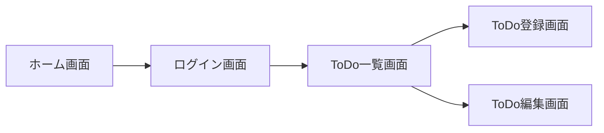

# 概要

## 本章で学ぶこと

- ルーティングの設定
- ページの返却

## 用意するルート

本章ではルーティングの設定を行います。

今回開発するアプリでは以下の画面を用意する予定です。

|画面|メソッド|URL|
|:-|:-|:-|
|ホーム画面|`GET`|`/`|
|ログイン画面|`GET`|`/login`|
|アカウント登録画面|`GET`|`/signup`|
|ToDo一覧画面|`GET`|`/todo`|
|ToDo登録画面|`GET`|`/todo/new`|
|ToDo編集画面|`GET`|`/todo/edit/{id}`|

画面遷移は以下のようなイメージです。



# ルーティングとコントローラーの関係

他のフレームワークの中にはルーティングとコントローラーが一体となっているものもありますが、Laravelの場合は別々になっています。

ルーティングは`routes/web.php`で行い、コントローラーは`app/Http/Controllers`以下に配置します。

コントローラーは`web.php`によって呼び出される形になります。

:::message
**ルーティング設定時に気をつけること**

Laravelはコントローラーを使わなくても`web.php`からデータやページを返すことができます。

しかし時際に実装するときはデータを返却するロジックを記述する場所をどちらか一方に統一することをお勧めします。

単純で少ない処理なら`web.php`に書いてしまってもいいんじゃないか、と思うかもしれませんが、ロジックを分散させないためにも、同じようなロジックは同じ場所にまとめましょう。

今回は基本的にコントローラーを使ってページとデータの返却を行います。
:::

# ルーティングとページの設定

先ほど提示したURL通りにルーティングの設定を行います。

まずはURLごとに返却するページを作成します。

Bladeのページを作成するにあたって、マニュアルでファイルを作成してもいいのですが、今回は`artisan`コマンドを使って作成しましょう。

```bash:/laravel-app
$ php artisan make:view home
$ php artisan make:view login
$ php artisan make:view signup
$ php artisan make:view todo/index
$ php artisan make:view todo/new
$ php artisan make:view todo/edit
```

ページの内容はさしあたり以下のようにしておきます。

```php:/laravel-app/resources/views/home.blade.php
<div>
    <h1>ホーム画面</h1>
</div>
```

```php:/laravel-app/resources/views/login.blade.php
<div>
    <h1>ログイン画面</h1>
</div>
```

```php:/laravel-app/resources/views/signup.blade.php
<div>
    <h1>アカウント登録画面</h1>
</div>
```

```php:/laravel-app/resources/views/todo/index.blade.php
<div>
    <h1>ToDo一覧</h1>
</div>
```

```php:/laravel-app/resources/views/todo/new.blade.php
<div>
    <h1>ToDo登録</h1>
</div>
```

```php:/laravel-app/resources/views/todo/edit.blade.php
<div>
    <h1>ToDo編集</h1>
</div>
```

以下のように`web.php`を変更しましょう。

```diff php:/laravel-app/routes/web.php

- Route::get('/', function () {
-     return view('welcome');
- });
 
+ Route::get('/', function () {
+     return view('home');
+ })->name('home');
+ 
+ Route::get('/login', function() {
+     return view(('login'));
+ })->name('login');
+ 
+ Route::get('/signup', function() {
+     return view(('signup'));
+ })->name('signup');
+ 
+ Route::prefix('/todo')
+     ->as('todo.')
+     ->group(function () {
+ 
+         Route::get('/', function() {
+             return view('todo.index');
+         })->name('index');
+ 
+         Route::get('/new', function () {
+             return view('todo.new');
+         })->name('new');
+ 
+         Route::get('/edit', function () {
+             return view('todo.edit');
+         })->name('edit');
+     });

```

それぞれのURLに飛んで正しく表示されているでしょうか。

ここで一度ルートとルート名が正しく設定されているか確認してみましょう。

ルートの確認は`php artisan route:list`で確認できます。

```bash:/laravel-app
$ php artisan route:list

GET|HEAD       / ........................................................................................................... home
  GET|HEAD       login ...................................................................................................... login
  GET|HEAD       signup .................................................................................................... signup
  GET|HEAD       storage/{path} ..................................................................................... storage.local
  GET|HEAD       todo .................................................................................................. todo.index
  GET|HEAD       todo/new ................................................................................................ todo.new
  GET|HEAD       todo/edit .............................................................................................. todo.edit
  GET|HEAD       up ............................................................................................................... 

```

ここでは`Route`というクラスを使いました。ルーティング関係の処理では何度もお世話になるクラスです。

`Route::prefix`を使うことでURLの共通部分を定義することができ、同じ親URLに属するルートは`Route::group`でまとめることができます。

こんすることで関係するルート同士をまとめることができて可読性が上がります。

`Route::as`は`prefix`と似たような役割があり、ルート名の共通部分を定義できます。

`/todo`以下のルート名では`as('todo.)`とすることで、それ以下のルート名の接頭辞として`todo.`という名前をつけています。

:::message
**ルートに名前をつける理由**

ルートに名前をつけると名前と対象のURLを関連付けてくれます。

こうすることで、突然何にかしらの理由でURL名が変更になった時も、`web.php`上のURLを変更することで、同じ名前のルートを利用しているすべての箇所に変更を反映させることができます。
:::

ルーティングの設定は以上ですが、`web.php`に関しては今後も何度か手を加えていくことになります。